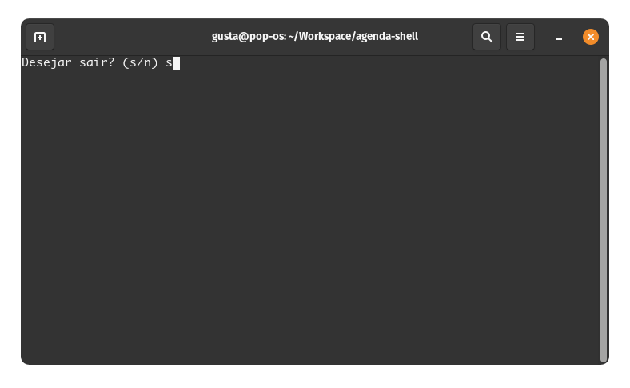

# Agenda Shell<!-- omit from toc -->

Script que serve como uma agenda telefonica que salva e consulta os dados em um arquivo txt.

## Tabela de conteúdos <!-- omit from toc -->

- [Features](#features)
- [Como rodar](#como-rodar)
  - [Salvar Contato](#salvar-contato)
  - [Buscar contato](#buscar-contato)
  - [Sair](#sair)

## Features

- [x] Cadastro de contatos
- [x] Pesquisa de contatos

## Como rodar

Rodar o script `path/to/agenda-shell/agenda.sh`

Irá abrir o menu inicial:

### Salvar Contato

Escolher a opção 1, que abrirá o prompt para colocar os dados

### Buscar Contato

Escolher a opção 2, que abrirá um sub menu para escolher o atributo da busca:

Após escolher, basta passar a informação para o prompt

### Sair

Escolher a opção 3 e confirmar

